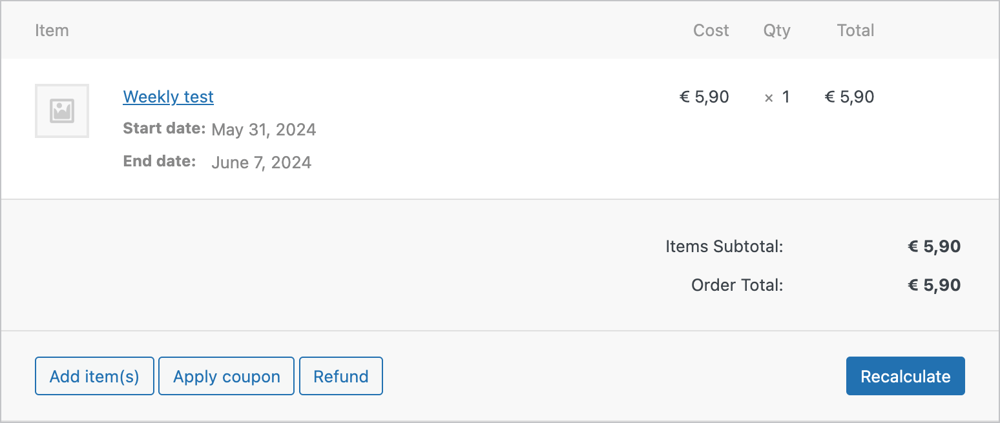
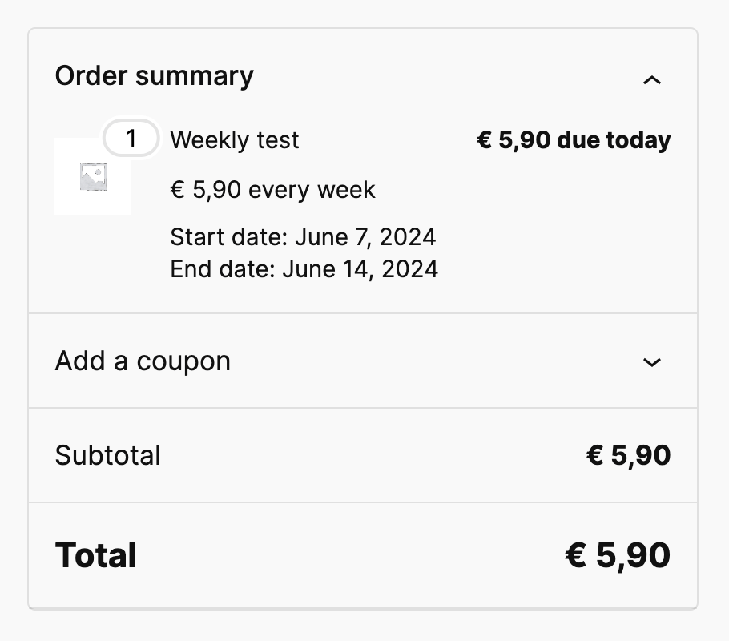

# Pronamic period information for Woo Subscriptions

This “Woo Subscriptions” add-on ensures that a period is saved with each subscription order. The “Woo Subscriptions” plugin itself does not store the subscription period in an order. Without this add-on, it is not clear to webshop owners and customers for what period the subscription order and associated payment was.

## Order item meta

Period is stored in the following order item meta:

| Key                    | Description.       |
| ---------------------- | ------------------ |
| `_pronamic_start_date` | Period start date. |
| `_pronamic_end_date`   | Period end date.   |

## Usage

```php
$orders = \wc_get_orders(
	[
		'status'  => [
			'wc-completed',
			'wc-refunded',
		],
		'type'    => 'shop_order',
		'limit'   => 10,
		'orderby' => 'date',
		'order'   => 'ASC',
	]
);

foreach ( $orders as $order ) {
	echo 'Order: ', $order->get_id(), PHP_EOL;

	foreach ( $order->get_items() as $item ) {
		echo '- Start date: ', $item->get_meta( '_pronamic_start_date' ), PHP_EOL;
		echo '- End date: ', $item->get_meta( '_pronamic_end_date' ), PHP_EOL;
	}
}
```

## Screenshots

### WordPress admin dashboard



_Screenshot of the WooCommerce order detail page in the WordPress admin dashboard with the period visible per item._

### WooCommerce checkout page



_Screenshot of the WooCommerce checkout page where a customer manually renews a subscription (early) and the period is visible._

# Accounting programs

Certain accounting programs offer the option to define a period for invoice lines. In this way, an accounting program can automatically distribute the amounts over a period. This can be used for “Prepaid expenses” and “Deferred revenue” on the balance sheet.

## Moneybird

Moneybird is an accounting program with the option to set a period per invoice line:

- https://help.moneybird.nl/support/solutions/articles/103000075937-periodeselectie-op-je-facturen
- https://www.moneybird.nl/blog/191-moneybird-preview-je-volledige-boekhouding-in-moneybird

This plugin can make it easier to connect WooCommerce Subscriptions orders to your accounting in Moneybird.

## Links

- https://github.com/pronamic/woocommerce-subscriptions
- https://github.com/Automattic/woocommerce-subscriptions-core/
- https://github.com/pronamic/woocommerce-subscriptions/issues/10
